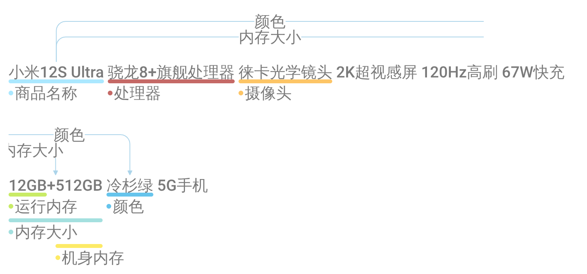
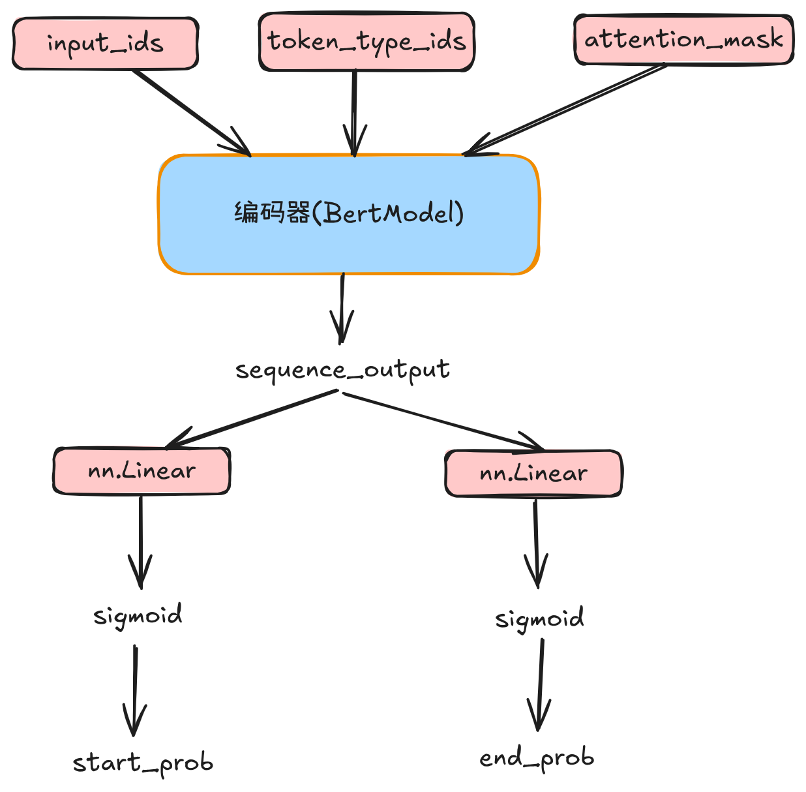
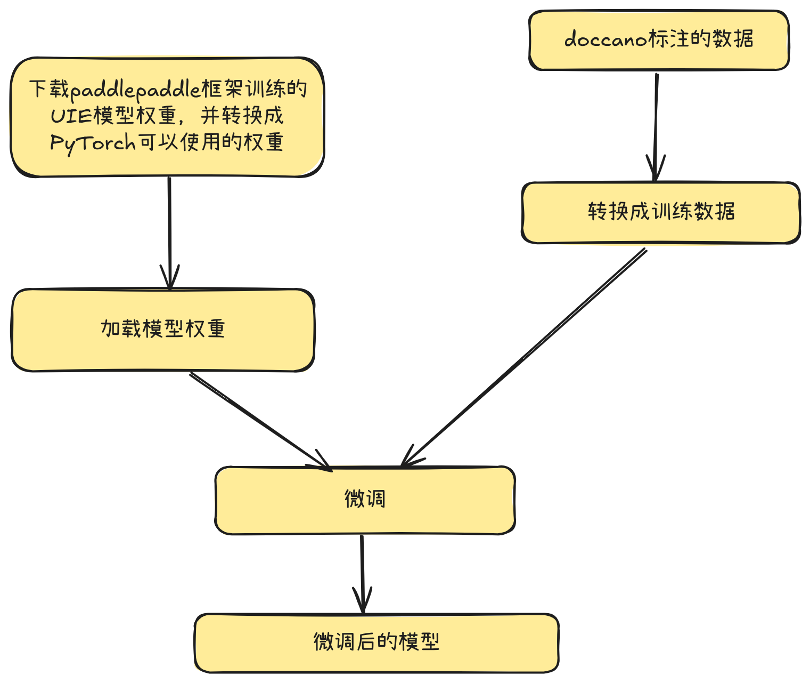

# UIE模型微调教程

## 试用一下

```py
$ python uie_test.py
```

## doccano标注数据



doccano标注的数据在到处之后，会生成 json 数据。

```json
{
  "id": 7,
  "text": "小米12S Ultra 骁龙8+旗舰处理器 徕卡光学镜头 2K超视感屏 120Hz高刷 67W快充 12GB+512GB 冷杉绿 5G手机",
  "entities": [
    {
      "id": 80,
      "label": "商品名称",
      "start_offset": 0,
      "end_offset": 11
    },
    {
      "id": 81,
      "label": "颜色",
      "start_offset": 61,
      "end_offset": 64
    },
    {
      "id": 82,
      "label": "运行内存",
      "start_offset": 50,
      "end_offset": 54
    },
    {
      "id": 83,
      "label": "机身内存",
      "start_offset": 55,
      "end_offset": 60
    },
    {
      "id": 84,
      "label": "摄像头",
      "start_offset": 22,
      "end_offset": 28
    },
    {
      "id": 85,
      "label": "处理器",
      "start_offset": 12,
      "end_offset": 21
    },
    {
      "id": 86,
      "label": "内存大小",
      "start_offset": 50,
      "end_offset": 60
    }
  ],
  "relations": [
    {
      "id": 35,
      "from_id": 80,
      "to_id": 81,
      "type": "颜色"
    },
    {
      "id": 38,
      "from_id": 80,
      "to_id": 86,
      "type": "内存大小"
    }
  ],
  "Comments": []
}
```

## 将doccano标注的数据转换成我们训练模型的训练数据

```py
python doccano.py --doccano_file ./doccano_ext.json --task_type "ext" --save_dir ./data --negative_ratio 5
```

通过观察以下的数据可以得知，我们标注的“实体“，`prompt`代表提示词，`result_list`代表预测结果。

我们标注的如果是实体，则发现`prompt`是”实体类型“，`result_list`是”实体名称“

我们标注的如果是实体之间的关系，那么`prompt`是”`实体1` + `的` + `关系`“拼接而成的字符串，而`result_list`是预测的实体。例如：

```
实体1：小米12S Ultra
关系：颜色
拼接成的prompt字符串：小米12S Ultra的颜色

result_list：
实体2：冷杉绿
```

```json
{"content": "小米12S Ultra 骁龙8+旗舰处理器 徕卡光学镜头 2K超视感屏 120Hz高刷 67W快充 12GB+512GB 冷杉绿 5G手机", "result_list": [{"text": "小米12S Ultra", "start": 0, "end": 11}], "prompt": "商品名称"}
{"content": "小米12S Ultra 骁龙8+旗舰处理器 徕卡光学镜头 2K超视感屏 120Hz高刷 67W快充 12GB+512GB 冷杉绿 5G手机", "result_list": [{"text": "冷杉绿", "start": 61, "end": 64}], "prompt": "颜色"}
{"content": "小米12S Ultra 骁龙8+旗舰处理器 徕卡光学镜头 2K超视感屏 120Hz高刷 67W快充 12GB+512GB 冷杉绿 5G手机", "result_list": [{"text": "12GB", "start": 50, "end": 54}], "prompt": "运行内存"}
{"content": "小米12S Ultra 骁龙8+旗舰处理器 徕卡光学镜头 2K超视感屏 120Hz高刷 67W快充 12GB+512GB 冷杉绿 5G手机", "result_list": [{"text": "512GB", "start": 55, "end": 60}], "prompt": "机身内存"}
{"content": "小米12S Ultra 骁龙8+旗舰处理器 徕卡光学镜头 2K超视感屏 120Hz高刷 67W快充 12GB+512GB 冷杉绿 5G手机", "result_list": [{"text": "徕卡光学镜头", "start": 22, "end": 28}], "prompt": "摄像头"}
{"content": "小米12S Ultra 骁龙8+旗舰处理器 徕卡光学镜头 2K超视感屏 120Hz高刷 67W快充 12GB+512GB 冷杉绿 5G手机", "result_list": [{"text": "骁龙8+旗舰处理器", "start": 12, "end": 21}], "prompt": "处理器"}
{"content": "小米12S Ultra 骁龙8+旗舰处理器 徕卡光学镜头 2K超视感屏 120Hz高刷 67W快充 12GB+512GB 冷杉绿 5G手机", "result_list": [{"text": "12GB+512GB", "start": 50, "end": 60}], "prompt": "内存大小"}
{"content": "小米12S Ultra 骁龙8+旗舰处理器 徕卡光学镜头 2K超视感屏 120Hz高刷 67W快充 12GB+512GB 冷杉绿 5G手机", "result_list": [{"text": "冷杉绿", "start": 61, "end": 64}], "prompt": "小米12S Ultra的颜色"}
{"content": "小米12S Ultra 骁龙8+旗舰处理器 徕卡光学镜头 2K超视感屏 120Hz高刷 67W快充 12GB+512GB 冷杉绿 5G手机", "result_list": [{"text": "12GB+512GB", "start": 50, "end": 60}], "prompt": "小米12S Ultra的内存大小"}
```

## 将训练数据转换成(输入, 输出)对

有了`(输入, 输出)`对，我们就可以来训练模型了。问题来了，训练模型时使用的`(输入, 输出)`对是什么呢？

首先看输入，输入是三个向量。

输入：`(input_ids, token_type_ids, attention_mask)`

我们的`最大序列长度`假设设为64，也就是序列长度不够64，会被填充到64的长度，超过64会被截断，保证向量的长度一致。

训练数据以下面的一条json数据为例子。

```json
{"content": "小米12S Ultra 骁龙8+旗舰处理器 徕卡光学镜头 2K超视感屏 120Hz高刷 67W快充 12GB+512GB 冷杉绿 5G手机", "result_list": [{"text": "12GB+512GB", "start": 50, "end": 60}], "prompt": "小米12S Ultra的内存大小"}
```

数据转换成的 `input_ids` 向量为：`[1, 96, 256, 768, 9478, 10663, 5, 103, 476, 19, 96, 2, 96, 256, 768, 9478, 10663, 4350, 550, 585, 12055, 1354, 1605, 239, 38, 361, 5533, 777, 325, 18, 1265, 306, 10585, 634, 367, 345, 1470, 2259, 9676, 69, 1697, 2784, 9513, 532, 684, 7661, 9510, 12055, 5847, 10101, 888, 2487, 782, 4831, 247, 98, 2]`

如果我们将 id 和对应的 token 打印出来，是这样的：

```
ID: 1 -> Token: [CLS]
ID: 96 -> Token: 小
ID: 256 -> Token: 米
ID: 768 -> Token: 12
ID: 9478 -> Token: ##s
ID: 10663 -> Token: ultra
ID: 5 -> Token: 的
ID: 103 -> Token: 内
ID: 476 -> Token: 存
ID: 19 -> Token: 大
ID: 96 -> Token: 小
ID: 2 -> Token: [SEP]
ID: 96 -> Token: 小
ID: 256 -> Token: 米
ID: 768 -> Token: 12
ID: 9478 -> Token: ##s
ID: 10663 -> Token: ultra
ID: 4350 -> Token: 骁
ID: 550 -> Token: 龙
ID: 585 -> Token: 8
ID: 12055 -> Token: +
ID: 1354 -> Token: 旗
ID: 1605 -> Token: 舰
ID: 239 -> Token: 处
ID: 38 -> Token: 理
ID: 361 -> Token: 器
ID: 5533 -> Token: 徕
ID: 777 -> Token: 卡
ID: 325 -> Token: 光
ID: 18 -> Token: 学
ID: 1265 -> Token: 镜
ID: 306 -> Token: 头
ID: 10585 -> Token: 2k
ID: 634 -> Token: 超
ID: 367 -> Token: 视
ID: 345 -> Token: 感
ID: 1470 -> Token: 屏
ID: 2259 -> Token: 120
ID: 9676 -> Token: ##hz
ID: 69 -> Token: 高
ID: 1697 -> Token: 刷
ID: 2784 -> Token: 67
ID: 9513 -> Token: ##w
ID: 532 -> Token: 快
ID: 684 -> Token: 充
ID: 7661 -> Token: 12g
ID: 9510 -> Token: ##b
ID: 12055 -> Token: +
ID: 5847 -> Token: 512
ID: 10101 -> Token: ##gb
ID: 888 -> Token: 冷
ID: 2487 -> Token: 杉
ID: 782 -> Token: 绿
ID: 4831 -> Token: 5g
ID: 247 -> Token: 手
ID: 98 -> Token: 机
ID: 2 -> Token: [SEP]
```

可以看出来，训练数据的组织的格式是：

`[CLS] prompt [SEP] content [SEP]`

那么 `token_type_ids` 又表示什么呢？先看一下向量长什么样子

```
[0, 0, 0, 0, 0, 0, 0, 0, 0, 0, 0, 0, 1, 1, 1, 1, 1, 1, 1, 1, 1, 1, 1, 1, 1, 1, 1, 1, 1, 1, 1, 1, 1, 1, 1, 1, 1, 1, 1, 1, 1, 1, 1, 1, 1, 1, 1, 1, 1, 1, 1, 1, 1, 1, 1, 1, 1]
```

也就是说，`[CLS] prompt [SEP]` 这部分为 0, `content [SEP]` 这部分为1, 因为这两部分不是同一个类型的内容，所以需要用 0 和 1 区分开。

而 `attention_mask` 向量如下：

```
[1, 1, 1, 1, 1, 1, 1, 1, 1, 1, 1, 1, 1, 1, 1, 1, 1, 1, 1, 1, 1, 1, 1, 1, 1, 1, 1, 1, 1, 1, 1, 1, 1, 1, 1, 1, 1, 1, 1, 1, 1, 1, 1, 1, 1, 1, 1, 1, 1, 1, 1, 1, 1, 1, 1, 1, 1]
```

可以看到都是 1 ，也就是说，所有的 token 都需要 “被注意到” 。

接下来，我们再看一下模型的预测输出的结构，是两个向量 `(start_ids, end_ids)`

先来看 `start_ids` 向量。

```
[0, 0, 0, 0, 0, 0, 0, 0, 0, 0, 0, 0, 0, 0, 0, 0, 0, 0, 0, 0, 0, 0, 0, 0, 0, 0, 0, 0, 0, 0, 0, 0, 0, 0, 0, 0, 0, 0, 0, 0, 0, 0, 0, 0, 0, 1.0, 0, 0, 0, 0, 0, 0, 0, 0, 0, 0, 0, 0, 0, 0, 0, 0, 0, 0]
```

可以看到索引为 45 的值是 `1.0`，对应的 token 是`12g` 。

再来看一下 `end_ids` 向量

```
[0, 0, 0, 0, 0, 0, 0, 0, 0, 0, 0, 0, 0, 0, 0, 0, 0, 0, 0, 0, 0, 0, 0, 0, 0, 0, 0, 0, 0, 0, 0, 0, 0, 0, 0, 0, 0, 0, 0, 0, 0, 0, 0, 0, 0, 0, 0, 0, 0, 1.0, 0, 0, 0, 0, 0, 0, 0, 0, 0, 0, 0, 0, 0, 0]
```

可以看到索引为 49 的值是 `1.0`，对应的 token 是 `##gb` 。

45 ～ 49 的token是：

```
ID: 7661 -> Token: 12g
ID: 9510 -> Token: ##b
ID: 12055 -> Token: +
ID: 5847 -> Token: 512
ID: 10101 -> Token: ##gb
```

是我们想要预测的结果。

所以模型的输入是：`(input_ids, token_type_ids, attention_mask)`，输出是：`(start_ids, end_ids)`。

我们要构建的模型，需要让预测和真实输出之间的误差尽可能的小。也就是要让两者之间的二分类交叉熵（binary cross entropy）尽可能的小。

而训练好的UIE模型就能做到这一点。

接下来我们看一下模型的结构。

## 模型

模型的总架构如下图



## 微调流程



## 将doccano标注数据转换成训练数据

```sh
$ python doccano2traindataset.py --doccano_file ./doccano_ext.json --task_type "ext" --save_dir ./data
```

## 微调代码

```sh
$ python finetune.py \
    --train_path "./data/train.txt" \
    --dev_path "./data/dev.txt" \
    --save_dir "./checkpoint" \
    --learning_rate 1e-5 \
    --batch_size 16 \
    --max_seq_len 64 \
    --num_epochs 100 \
    --seed 1000 \
    --valid_steps 100 \
    --device "gpu"
```